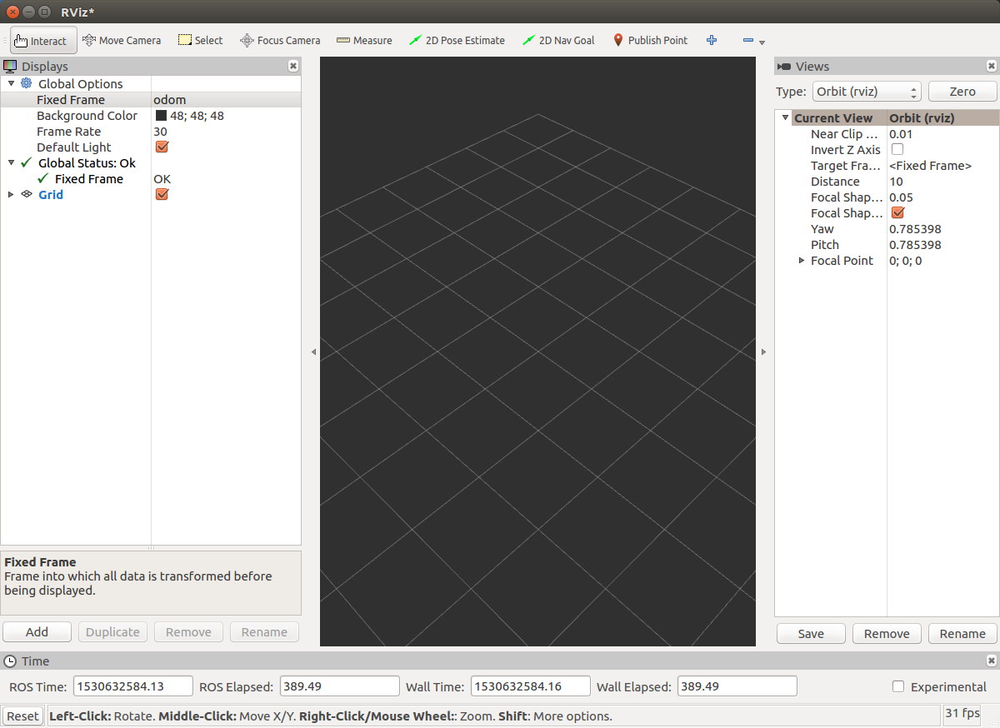
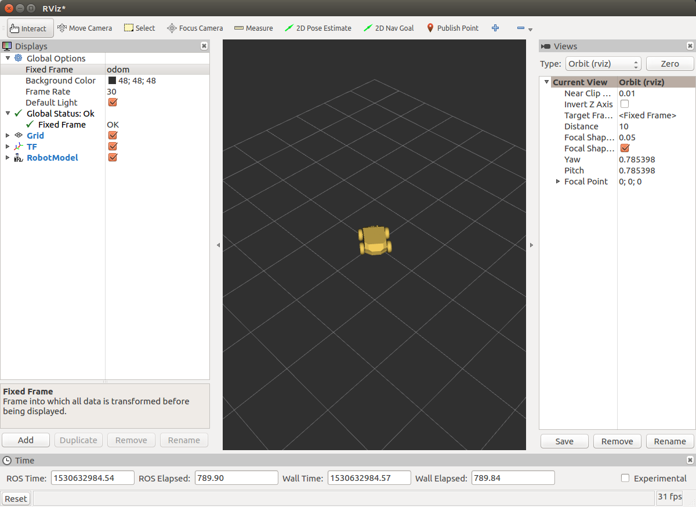
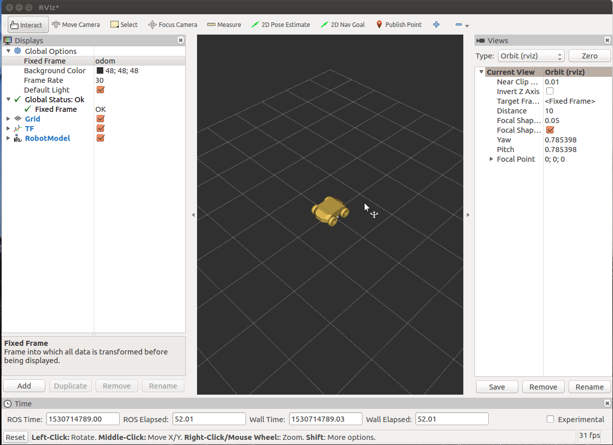
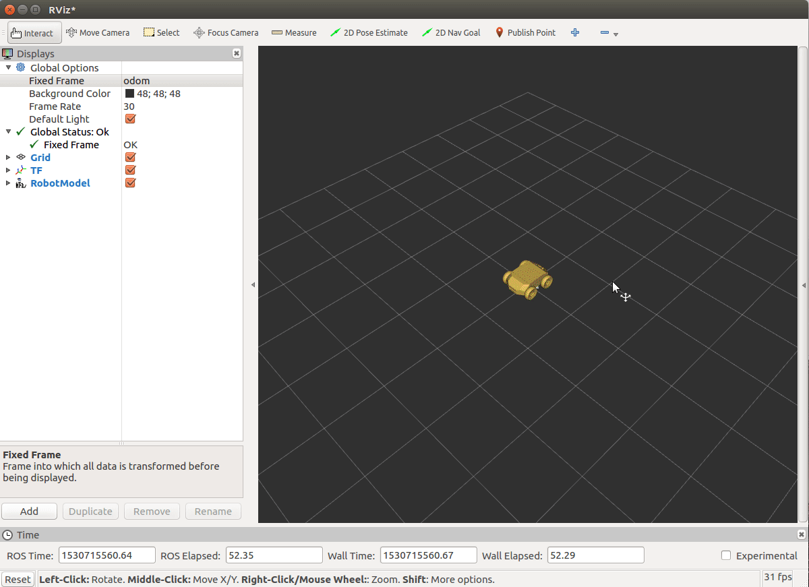
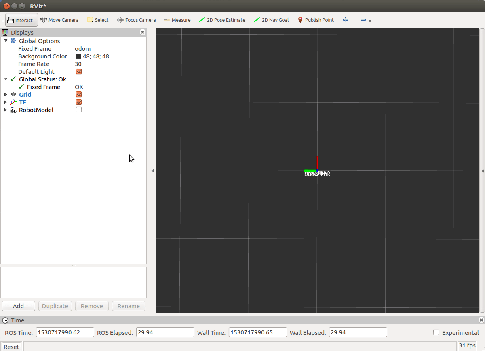

===================================
Autolabor Simulation Base 模块介绍
===================================

功能介绍
===================================
Autolabor Simulation Base 主要用于模拟差速转向的移动机器人底盘，其运作模式为订阅 `ROS速度信息 <http://docs.ros.org/api/geometry_msgs/html/msg/Twist.html>`_ ，根据底盘自身参数限制(这里主要限制因素有最大速度与最大加速度)，以及设置的噪音参数模拟小车运行速度。并根据速度控制小车在X-Y平面中行驶。

小车在运行过程中会发布 `ROS里程计信息 <http://docs.ros.org/api/nav_msgs/html/msg/Odometry.html>`_ 此处里程计数据中包含噪声，用于模拟真实情况下的里程计数据。

同时该模块会发布两个坐标转换信息

* 里程计坐标系 ——> 小车底盘坐标系 的坐标转换
* 小车底盘坐标系 ——> 真实坐标系 的坐标转换

.. NOTE:: 在ROS中坐标转换树中，一个子节点最多只能有一个父节点。作为子节点 **小车底盘坐标系** 不能同时拥有两个坐标系(**里程计坐标系**，**真实坐标系**)，所以在坐标转换树中将 **真实坐标系** 作为 **小车底盘坐标系** 的子节点。

节点信息
==================================

订阅话题
----------------------------------
:话题名称: /cmd_vel
:消息类型: `geometry_msgs/Twist <http://docs.ros.org/api/geometry_msgs/html/msg/Twist.html>`_
:话题说明: 用于控制机器人地盘运动的速度指令

.. admonition:: geometry_msgs/Twist 数据类型说明

  ::

    geometry_msgs/Vector3 linear    线速度 单位为 m/s
      float64 x                     前后移动的速度，+表示向前，-表示向后
      float64 y                     左右移动的速度，+表示向左，-表示向右
      float64 z                     上下移动的速度，+表示向上，-表示向下
    geometry_msgs/Vector3 angular   角速度 单位为 rad/s
      float64 x                     横滚角速度，正负号依据右手法则决定
      float64 y                     俯仰角速度，正负号依据右手法则决定
      float64 z                     航向角速度，俯视小车时，+表示逆时针旋转，-表示顺时针旋转

  | 小车使用差速转向，仅能前后运动，所以在 **线速度** 中只有 **X分量** 有数据，其余分量为0
  | 小车在水平面行驶，仅能水平转动，所以在 **角速度** 中只有 **Z分量** 有数据，其余分量为0

发布话题
----------------------------------
:话题名称: /odom
:消息类型: nav_msgs/Odometry <http://docs.ros.org/api/nav_msgs/html/msg/Odometry.html>`_
:话题说明: 发布机器人的轮速里程计信息(此处数据带有噪音)

.. admonition:: nav_msgs/Odometry 数据类型说明

  ::

    std_msgs/Header header                     数据头信息
      uint32 seq                               数据序列号
      time stamp                               数据时间戳信息
      string frame_id                          姿态数据(pose)所处的坐标系
    string child_frame_id                      速度数据(twist)所在的坐标系
    geometry_msgs/PoseWithCovariance pose
      geometry_msgs/Pose pose                  里程计姿态数据信息
        geometry_msgs/Point position           里程计姿态数据的位置信息
          float64 x
          float64 y
          float64 z
        geometry_msgs/Quaternion orientation   里程计姿态数据的方向信息(四元数)
          float64 x
          float64 y
          float64 z
          float64 w
      float64[36] covariance                   姿态数据的协方差矩阵(x, y, z, roll, pitch, yaw)
    geometry_msgs/TwistWithCovariance twist    里程计速度数据信息
      geometry_msgs/Twist twist
        geometry_msgs/Vector3 linear           线速度信息
          float64 x
          float64 y
          float64 z
        geometry_msgs/Vector3 angular          角速度信息
          float64 x
          float64 y
          float64 z
      float64[36] covariance                   速度信息的协方差矩阵(vx, vy, vz, v_roll, v_pitch, v_yaw)

节点参数
-----------------------------
.. raw:: html

   

:参数名称: ~odom_frame
:参数类型: string
:默认数据: odom
:参数说明: 里程计坐标系的名称

.. raw:: html

   

:参数名称: ~base_link_frame
:参数类型: string
:默认数据: base_link
:参数说明: 小车坐标系的名称

.. raw:: html

   

:参数名称: ~real_map_frame
:参数类型: string
:默认数据: real_map
:参数说明: 真实坐标系的名称

.. raw:: html

   

:参数名称: ~noise_v_linear
:参数类型: double
:默认数据: 0.0
:参数限制: 必须大于等于0
:参数说明: 模拟行驶过程中在线速度中添加白噪音的标准差，单位为m/s，默认为不添加噪音

.. raw:: html

   

:参数名称: ~noise_v_theta
:参数类型: double
:默认数据: 0.0
:参数限制: 必须大于等于0
:参数说明: 模拟行驶过程中在角速度中添加白噪音的标准差，单位为rad/s，默认为不添加噪音

.. raw:: html

   

:参数名称: ~max_a_linear
:参数类型: double
:默认数据: 999.0
:参数限制: 必须大于0
:参数说明: 小车底盘行驶最大线加速度，单位为 m/s^2, 默认是一个比较大的值，在正常模拟情况下。小车能直接达到所给的速度

.. raw:: html

   

:参数名称: ~max_a_theta
:参数类型: double
:默认数据: 999.0
:参数限制: 必须大于0
:参数说明: 小车底盘行驶最大角加速度，单位为 rad/s^2, 默认是一个比较大的值，在正常模拟情况下。小车能直接达到所给的速度

.. raw:: html

  

:参数名称: ~max_v_linear
:参数类型: double
:默认数据: 1.0
:参数限制: 必须大于0
:参数说明: 小车底盘行驶线速度绝对值的最大值，单位为 m/s，比如在默认情况下，小车行驶速度为 :math:`-1.0 m/s \leq v \leq 1.0 m/s`, 当控制速度超出这个范围，小车按照离控制速度最近的极值运行

.. raw:: html

  

:参数名称: ~max_v_theta
:参数类型: double
:默认数据: 1.57
:参数限制: 必须大于0
:参数说明: 小车底盘行驶角速度绝对值的最大值，单位为 rad/s，说明与 max_v_linear 类似

.. raw:: html

  

:参数名称: ~rate
:参数类型: int
:默认数据: 30
:参数限制: 必须大于0
:参数说明: 小车模拟行驶更新位置的频率，也是里程计信息发布的频率，这个值越大，小车模拟行驶越平滑，同时需要计算量也就越大

.. raw:: html

  

使用示例
=================================
以下的实验步骤必须在安装好ROS环境以及编译Autolabor Simulation功能包的基础下进行，如果您还未执行上述操作，请先参考前面的使用文档。假设ROS工作目录为 ~/catkin_ws，并且Autolabor Simulation的源码放在 ~/catkin_ws/src 中，如果你的环境和上述不一致，需要在下面的脚本中做相应的替换。

进入ROS工作目录

.. code-block:: bash

    cd ~/catkin_ws

编译模拟器(如果您已经编译过，可忽略此步)

.. code-block:: bash

    catkin_make

添加模拟器相关环境变量

.. code-block:: bash

    source devel/setup.bash

进入autolabor_simulation_base包的launch文件夹

.. code-block:: bash

    roscd autolabor_simulation_base/launch

创建ROS脚本文件

.. code-block:: bash

    echo '<!-- autolabor_simulation_base demo -->
    <launch>
        <arg name="model" />
        <arg name="gui" default="false" />

        <param name="use_sim_time" value="false"/>
        <param name="robot_description" textfile="$(find autolabor_description)/urdf/autolabor_pro1.urdf" />
        <param name="use_gui" value="$(arg gui)" />

        <node pkg="autolabor_simulation_base" type="simulation_base_node" name="autolabor_driver" output="screen">
            <param name="odom_frame" value="odom"/>
            <param name="base_link_frame" value="base_link"/>
            <param name="real_map_frame" value="real_map"/>

            <param name="noise_v_linear" value="0"/>
            <param name="noise_v_theta" value="0"/>

            <param name="max_a_linear" value="999.0"/>
            <param name="max_a_theta" value="999.0"/>

            <param name="max_v_linear" value="1.0"/>
            <param name="max_v_theta" value="1.57"/>

            <param name="rate" value="100"/>
        </node>

        <node name="keyboard_control" pkg="autolabor_keyboard_control" type="keyboard_control_node">
            <param name="linear_min" value="0.2" />
            <param name="linear_max" value="1.0" />
            <param name="linear_step" value="0.2" />

            <param name="angular_min" value="0.5" />
            <param name="angular_max" value="1.57" />
            <param name="angular_step" value="0.5" />
        </node>

        <node name="joint_state_publisher" pkg="joint_state_publisher" type="joint_state_publisher" />
        <node name="robot_state_publisher" pkg="robot_state_publisher" type="state_publisher" />
        <node name="rviz" pkg="rviz" type="rviz"/>
    </launch>
    ' > demo_simulation_base.launch

执行刚才我们建立的ROS脚本

.. code-block:: bash

    roslaunch autolabor_simulation_base demo_simulation_base.launch

此时我们会发现打开了一个窗口，如图所示

.. figure:: _static/pic/rviz_1.png
  :width: 800px
  :align: center

  rviz窗口

在rviz的左侧Displays窗口，找到 Global Options -> Fixed Frame，并将后面的值选成odom，如下图

  修改Fixed Frame

点击rviz左下角的Add按钮，在跳出的窗口中选择 rviz -> TF，并单击OK按钮

.. figure:: _static/pic/rviz_3.png
  :width: 800px
  :align: center

  Add TF

同上操作步骤，点击rviz左下角的Add按钮，添加 rviz -> RobotModel，并单击OK按钮

  Add RobotModel

我们在中间区域看到一个小黄车，此时我们就可以使用键盘上的上，下，左，右控制小车行进。

  控制小车行驶

我们再来详细看一下坐标转换关系，关闭小车模型，将视窗放大。

  TF转换关系

根据默认设置，base_link表示小车坐标系，随着通过键盘控制，base_link坐标系在移动，在中间两个静止的坐标系分别是odom(里程计编码器)和real_map(真实坐标系)。由于我们没有设置里程计噪音real_map和odom始终重合，也就意味着里程计信息完全准确。

这个时候我们可以尝试修改ROS脚本文件demo_simulation_base.launch，将noise_v_linear改成0.2，noise_v_theta改成0.5。

首先在刚才打开Terminal的窗口使用Ctrl+C，结束之前的命令，并输入下面内容。

.. code-block:: bash

    sed -i 's/<param name="noise_v_linear" value="0"\/>/<param name="noise_v_linear" value="0.2"\/>/' demo_simulation_base.launch
    sed -i 's/<param name="noise_v_theta" value="0"\/>/<param name="noise_v_theta" value="0.5"\/>/' demo_simulation_base.launch

此时再运行该脚本

.. code-block:: bash

    roslaunch autolabor_simulation_base demo_simulation_base.launch

按照上面的方法在rviz中添加tf数据显示

  带噪音的情况

会发现在小车行驶过程中，odom和real_map之间发生相对变化，这个变化就是里程计偏离真实位置的情况。
