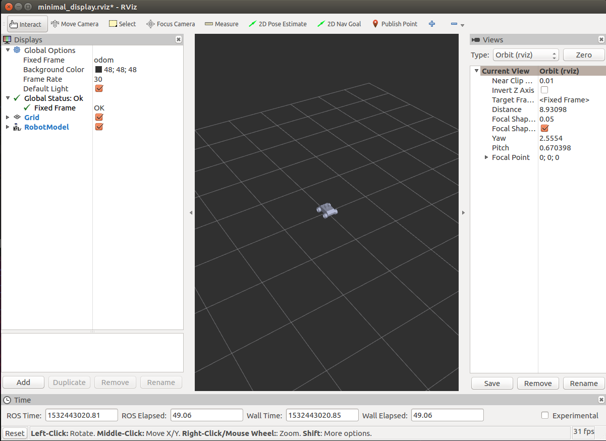
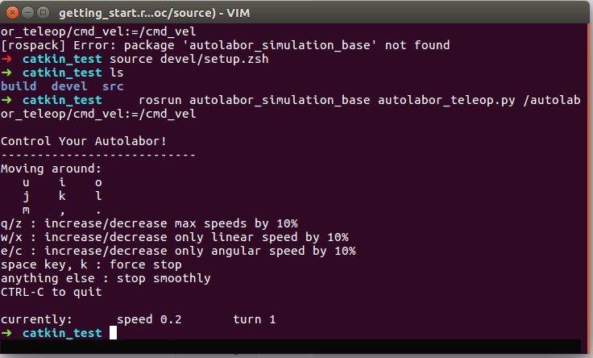
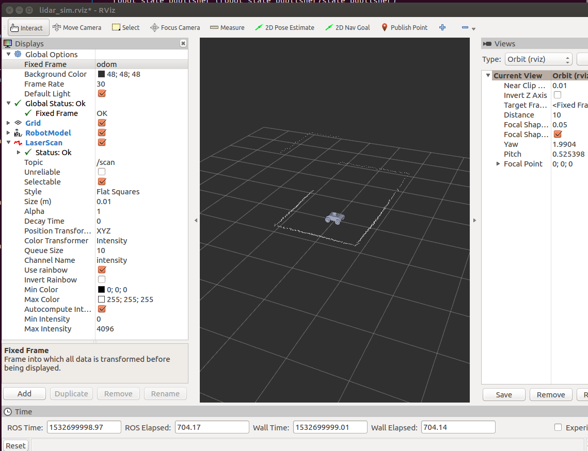

====================
开始
====================

依赖
=========

`Autolabor_simulation`_ 是基于ROS开发的轮式机器人模拟器，所以在使用前需要先安装ROS环境。如果你使用的是Ubuntu 16.04操作系统，ROS环境安装方式可参考 `ROS环境安装`_

如果你没有Ubuntu系统环境，可以在模拟器中安装 AutolaborOS，并在 AutolaborOS 中实现教程中所有功能。AutolaborOS 是基于 Ubuntu16.04 定制的机器人操作系统，其中包含ROS环境以及多种传感器驱动，同时包含模拟器以及导航建图功能模块。具体安装方式以及下载地址可以参考 `AutolaborOS安装`_

.. _Autolabor_simulation: https://github.com/gsc07/autolabor_simulation
.. _ROS环境安装: http://wiki.ros.org/kinetic/Installation/Ubuntu
.. _AutolaborOS安装: http://www.autolabor.com.cn/lib/video/play/4

编译安装
=====================

`Autolabor_simulation`_ 仓库由若干个 `Ros Package`_ 组成，仓库下的每个package
有自己的配置文件（package.xml），可以直接将 `Autolabor_simulation`_ 克隆到你
的workspace的src文件夹下，利用catkin_make编译autolabor_simulation.

创建你的 `catkin_workspace`_

.. code-block:: bash

    # Create catkin_workspace
    source /opt/ros/kinetic/setup.bash
    mkdir -p ~/catkin_ws/src
    cd ~/catkin_ws/
    catkin_make

下载并编译

.. code-block:: bash

    # Clone Autolabor_simulation to your workspace
    cd ~/catkin_ws/src/
    git clone https://github.com/gsc07/autolabor_simulation.git

    # Build source
    cd ..
    catkin_make
    source devel/setup.bash

如果希望ROS环境中默认包含autolabor_simulation，可以使用如下命令将workspace设为默认包含

.. code-block:: bash

    # Source workspace for every terminal
    source ~/catkin_ws/devel/setup.bash

.. _Autolabor_simulation: https://github.com/gsc07/autolabor_simulation
.. _Ros Package: http://wiki.ros.org/Packages
.. _catkin_workspace: http://wiki.ros.org/catkin/Tutorials/create_a_workspace

项目结构
==================
.. code-block:: bash

    ├── autolabor_description             移动机器人urdf模型
    │   ├── CMakeLists.txt
    │   ├── launch                        启动移动机器人模型相关launch脚本
    │   ├── meshes                        移动机器人三维模型
    │   ├── package.xml
    │   ├── rviz                          移动机器人rviz可视化配置参数
    │   └── urdf                          移动机器人三维模型相关配置参数
    ├── autolabor_keyboard_control        键盘控制模块
    │   ├── CMakeLists.txt
    │   ├── include                       键盘控制模块头文件
    │   ├── package.xml
    │   └── src                           键盘控制模块源代码
    ├── autolabor_simulation_base         移动机器人底盘模拟(包含轮速里程计模拟)
    │   ├── CMakeLists.txt
    │   ├── include                       底盘模块头文件
    │   ├── launch                        底盘模块测试launch脚本
    │   ├── package.xml
    │   └── src                           底盘模块源代码
    ├── autolabor_simulation_lidar        单线激光雷达模拟
    │   ├── CMakeLists.txt
    │   ├── include                       单线激光雷达模块头文件
    │   ├── launch                        单线激光雷达测试launch脚本
    │   ├── package.xml
    │   └── src                           单线激光雷达源代码
    ├── autolabor_simulation_object       动态障碍物模拟
    │   ├── CMakeLists.txt
    │   ├── include                       动态障碍物模拟模块头文件
    │   ├── launch                        动态障碍物模拟模块launch脚本
    │   ├── package.xml
    │   └── src                           动态障碍物模拟模块源代码
    ├── autolabor_simulation_stage        自定义场景模拟
    │   ├── CMakeLists.txt
    │   ├── include                       自定义场景模拟模块头文件
    │   ├── launch                        自定义场景模拟模块测试launch脚本
    │   ├── map                           场景地图
    │   ├── package.xml
    │   ├── src                           自定义场景模拟模块源代码
    │   └── srv                           自定义场景模拟模块ROS中使用的自定义消息
    ├── doc                               说明文档
    │   ├── make.bat
    │   ├── Makefile
    │   └── source
    ├── README.md
    └── script                            模拟器相关脚本
        └── add_keyboard_udev             添加键盘映射脚本

**使用现成的launch file模拟器组合**

我们提供了许多编写好的launch file供使用者调用，他们展示了模拟器内各个组件不同的设置，
以及模拟器与其他ROS工具（例如Navigtation Stack，gmapping）配合的示例。所有的

运行一个 `autolabor_simulation_base`_ 模拟，并且使用键盘控制机器人：

.. code-block:: bash

    # Please make sure you have sourced the devel/setup.bash file
    roslaunch simulation_launch minimal_bringup.launch

    # open a new terminal and source the devel/setup.bash file again
    rosrun autolabor_simulation_base autolabor_teleop.py /autolabor_teleop/cmd_vel:=/cmd_vel

命令执行完后，会在rviz窗口中看到机器人模型并且打开一个键盘控制机器人的终端，如下图所示。

切换到autolabor_teleop.py对应的终端，根据终端中的提示信息，按住u,i,o,j,k,l等键即可看到机器人模型
在键盘的控制下在rviz中移动。

**编写自己的launch file文件完成模拟功能**

这个部分我们通过配置launch file文件实现模拟小车和雷达模拟器的功能。

在你的catkin workspace里新建一个package用来存放launch file文件：

.. code-block:: bash

    cd autolabor_simulation
    catkin_create_pkg simulation_launch_local
    cd simulation_launch_local
    mkdir launch
    mkdir rviz
    cd launch

新建一个命名为lidar_sim.launch的文件，使用你喜欢的编辑器打开它，按照下列顺序依次添加配置选项：

加载机器人描述文件和对应的关节支持辅助节点，设置rviz的默认存储路径：

.. code-block:: xml

    <launch>
      <arg name="model" />
      <arg name="gui" default="false" />

      <param name="use_sim_time" value="false"/>
      <param name="robot_description" textfile="$(find autolabor_description)/urdf/autolabor_mini.urdf" />
      <param name="use_gui" value="$(arg gui)" />

      <node name="joint_state_publisher" pkg="joint_state_publisher" type="joint_state_publisher" />
      <node name="robot_state_publisher" pkg="robot_state_publisher" type="state_publisher" />
      <node name="rviz" pkg="rviz" type="rviz" args="-d $(find simulation_launch_local)/rviz/lidar_sim.rviz" />
    </launch>

添加autolabor_simulation_base节点模拟机器人底盘。

.. code-block:: xml

    ...
      <node pkg="autolabor_simulation_base" type="simulation_base_node" name="autolabor_driver" output="screen">
        <param name="map_frame" value="odom"/>
        <param name="odom_frame" value="odom"/>
        <param name="base_link_frame" value="base_link"/>
        <param name="real_map_frame" value="real_map"/>

        <param name="noise_v_linear" value="0"/>
        <param name="noise_v_theta" value="0"/>

        <param name="max_a_linear" value="999.0"/>
        <param name="max_a_theta" value="999.0"/>

        <param name="max_v_linear" value="1.0"/>
        <param name="max_v_theta" value="1.57"/>

        <param name="rate" value="100"/>
      </node>
    ...

通过map_server加载预先画好的地图。这部分我们使用 `autolabor_simulation_stage`_ 接受加载好的地图，并且
传递给 `autolabor_simulation_lidar`_ 生成模拟雷达数据。

.. code-block:: xml

    ...
      <node pkg="map_server" type="map_server" name="map_server" args="$(find autolabor_simulation_stage)/map/MG_map.yaml" >
        <remap from="map" to="reserve_map" />
        <remap from="map_metadata" to="reserve_map_metadata" />
      </node>

      <node name="simulation_stage" pkg="autolabor_simulation_stage" type="simulation_stage_node" output="screen">
        <param name="input_topic" value="reserve_map" />
        <param name="output_topic" value="stage_map" />
        <param name="real_map_frame" value="real_map" />
      </node>

      <node name="simulation_lidar" pkg="autolabor_simulation_lidar" type="simulation_lidar_node" output="screen">
        <param name="min_angle" value="-3.141592654" />
        <param name="max_angle" value="3.141592654" />

        <param name="min_distance" value="0.15" />
        <param name="max_distance" value="6.00" />

        <param name="size" value="400" />
        <param name="rate" value="10" />
        <param name="noise" value="0.01" />

        <param name="stage_map_topic" value="stage_map" />
        <param name="global_frame" value="real_map" />
        <param name="lidar_frame" value="lidar" />
      </node>

lidar_sim.launch的全部代码见文件 `lidar_sim.launch`_

编辑完成并保存后，重新编译整个workspace，并运行launch file

.. code-block:: bash

    cd ~/catkin_ws
    catkin_make
    source devel/setup.bash
    roslaunch autolabor_simulation_local lidar_simulation.launch

在弹出的rviz窗口中，将Global Options中的Fixed Frame改为odom。点击左下方Add按钮，在"By display type"
选项中，选择RobotModel选项，点击"OK"，再次点击Add按钮，在"By topic"选项中选择scan标签下的Laserscan
类型，点击"OK"，之后就可以在rviz中看到小车模型和雷达模拟器数据了。

打开一个新的终端，启动遥控节点，控制小车前后移动观察雷达数据的变化：

.. code-block:: bash

    cd ~/catkin_ws
    source devel/setup.bash
    rosrun autolabor_simulation_base autolabor_teleop.py /autolabor_teleop/cmd_vel:=/cmd_vel

.. _autolabor_simulation_base: autolabor_simulation_base.html
.. _autolabor_simulation_stage: autolabor_simulation_stage.html
.. _autolabor_simulation_lidar: autolabor_simulation_lidar.html
.. _lidar_sim.launch: https://github.com/gsc07/autolabor_simulation/blob/master/simulation_launch/launch/lidar_sim.launch
